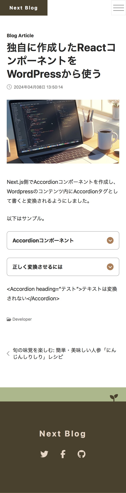

# Next.js and Headless WordPress Blog

## Table of Contents
- [Introduction](#introduction)
- [Motivation](#motivation)
- [Screenshots](#screenshots)
- [Tech Stack](#tech-stack)
- [Features](#features)
- [Code Examples](#code-examples)
- [Installation](#installation)
- [Usage](#usage)
- [Contributing](#contributing)
- [License](#license)
- [Acknowledgments](#acknowledgments)
- [Related Links](#related-links)

## Introduction
This project is a modern, fast, and SEO-friendly blog built using Next.js as the frontend and WordPress as a headless CMS. It leverages the best practices of modern web development to deliver an optimal user experience across all devices.

## Motivation
The motivation behind this project is to create a highly performant blog platform that combines the robust content management capabilities of WordPress with the sleek, modern frontend provided by Next.js. This setup allows for easy content updates through WordPress while maintaining a cutting-edge frontend performance.

## Screenshots



## Tech Stack
- **Frontend**: Next.js, React, Typescript
- **Backend**: WordPress (as a headless CMS)
- **Styling**: CSS Modules
- **Hosting**: Netlify (Frontend), Xserver (WordPress backend)

## Features
- Server-side rendered blog pages for improved SEO.
- Dynamic routing based on WordPress posts.
- Responsive design for all devices.
- Light and dark mode support.
- Complete isolation and concealment of WordPress.


## Code Examples
Below is a function to retrieve posts from WordPress using GraphQL and Apollo Client.
```typescript
// Combined post fragment incorporating featured image, categories, and tags
const postFragment = gql`
  fragment Post on Post {
    id
    slug
    title
    dateGmt
    modifiedGmt
    content
    ...PostFeaturedImage
    ...PostCategories
    ...PostTags
  }
  ${postFeaturedImageFragment}
  ${postCategoriesFragment}
  ${postTagsFragment}
`;

// Query to get a post by its slug
export const GET_POST_BY_SLUG = gql`
  query getPostBySlug($slug: ID = "") {
    post(id: $slug, idType: SLUG) {
      ...Post
    }
  }
  ${postFragment}
`;

// Retrieves a post by its slug.
export async function getPostBySlug(slug: string): Promise<Post | null> {
  const data = await fetchGraphQLData(GET_POST_BY_SLUG, { slug });
  if (!data?.post) {
    throw new NotFoundError(`Post with slug "${slug}" not found.`);
  }
  return data.post;
}
```

## Installation
1. **Set up the WordPress site:**
   - Install WordPress on your hosting service.
   - Install necessary plugins (`WPGraphQL`, `Deploy with NetlifyPress` or a plugin with equivalent functionality) through the WordPress admin panel.

2. **Set up the Next.js application:**
   - Clone this repository.
   - Install dependencies using `npm install`.
   - Initialize `local-ssl-proxy` using `npm run init`.
   - Rename `sample.env.local` to `.env.local` and update the variables to match your environment.
   - Run `npm run dev` to start the development server.

3. **Set up the Netlify:**
   - Connect your repository in the Netlify dashboard.
   - Set the `.env.local` variables as environment variables in Netlify.
   - Deploy your site.

## Usage
To view the blog, navigate to `https://192.168.1.2:9001/` after starting the development server. This IP address is used for local development testing. 

To allow mobile devices to access the development server, we avoid using `localhost`. If necessary, please update the scripts in `package.json` and the configurations in `ssl-config.json` to ensure proper connectivity.

For modifying website-related settings, such as site name or description, please edit `./app/_const/site-config.ts`.

To modify the HTML received from WordPress, please edit the options in `./app/_lib/html-react-parser.tsx`.


## Contributing
Contributions are welcome! Please feel free to submit pull requests, create issues for bugs and feature requests, and provide feedback.

## License
This project is licensed under the MIT License - see the LICENSE file for details.

## Acknowledgments
In learning the basics of Next.js, I referred to "[作って学ぶ Next.js/React Webサイト構築](https://ebisu.com/next-react-website/)" by Ebisucom. I would like to thank Ebisucom for publishing this excellent book.

And thanks to the creators of Next.js and WordPress.

## Related Links
- [Next.js Official Website](https://nextjs.org/)
- [React Official Website](https://reactjs.org/)
- [TypeScript Official Website](https://www.typescriptlang.org/)
- [WordPress Official Website](https://wordpress.org/)
- [Netlify Official Website](https://www.netlify.com/)
- [Xserver Official Website](https://www.xserver.co.jp/)
- [Ebisucom Official Website](https://ebisu.com/)

